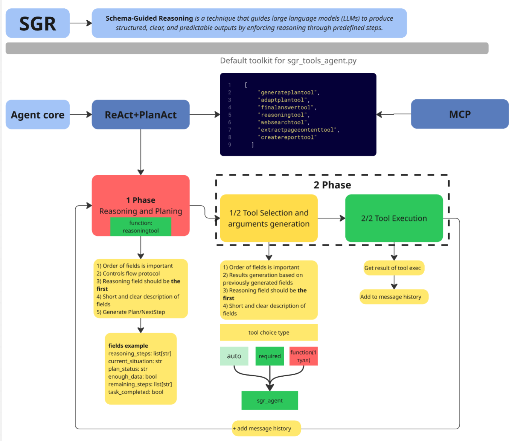

# SGR Deep Research - Open-Source Schema-Guided Reasoning System

## Description


Open-source framework for building intelligent research agents using Schema-Guided Reasoning. The project provides a core library with a extendable BaseAgent interface implementing a two-phase architecture and multiple ready-to-use research agent implementations built on top of it.

The library includes extensible tools for search, reasoning, and clarification, real-time streaming responses, OpenAI-compatible REST API. Works with any OpenAI-compatible LLM, including local models for fully private research.

______________________________________________________________________

## ⚡ Quick Start - SGRFileAgent

Fast launch of file search agent to find files on your computer:

```bash
# 1. Clone the repository
git clone https://github.com/vamplabAI/sgr-deep-research.git
cd sgr-deep-research

# 2. Create configuration file
cp config.yaml.example config.yaml

# 3. Edit config.yaml and add your API credentials:
#    api_key: "your-openai-api-key"
#    base_url: "https://api.openai.com/v1"  # or your custom endpoint
#    model: "gpt-4o-mini"  # or your preferred model

# 4. Start API server (in first terminal)
uv run python sgr_deep_research

# 5. Use the agent (in second terminal)
curl -X POST "http://0.0.0.0:8010/v1/chat/completions" \
  -H "Content-Type: application/json" \
  -d '{"model":"sgr_file_agent","messages":[{"role":"user","content":"Find all Python files larger than 1MB"}]}'
```

**Available agent models:**
- `sgr_file_agent` - file search and analysis (NEW!)
- `sgr_agent` - research agent with web search
- `sgr_tool_calling_agent` - agent with extended tools
- `sgr_auto_tools_agent` - agent with automatic tool selection

**Example queries for file agent:**
- "Find all Python files larger than 1MB"
- "Show all configuration files in the project"
- "Find files modified in the last 3 days"
- "Where are all .md files in the project?"

> **💡 Note for MacBook users:** Use `0.0.0.0` instead of `localhost` in curl requests

______________________________________________________________________

## SGRFileAgent - File Search Agent

**SGRFileAgent** - специализированный агент для поиска и анализа файлов в файловой системе.

### Возможности

Агент использует двухфазный подход (reasoning + action) и предоставляет 10 инструментов для работы с файлами:

#### 🗺️ Навигация и ориентация

1. **GetCurrentDirectoryTool** - узнать текущую рабочую директорию
2. **GetSystemPathsTool** - получить стандартные пути системы (home, documents, downloads, desktop и т.д.)

#### 🔍 Инструменты поиска

3. **FindFilesFastTool** ⚡ - **САМЫЙ БЫСТРЫЙ** - использует нативную команду `find` (10-100x быстрее!)
4. **ReadFileTool** - чтение содержимого файлов (с опциональным диапазоном строк)
5. **ListDirectoryTool** - просмотр содержимого директорий (с рекурсией)
6. **SearchFilesTool** - поиск файлов по имени/паттерну (`*.py`, `config.*`)
7. **SearchInFilesTool** - поиск текста внутри файлов (grep-подобный)
8. **FindByExtensionTool** - поиск по расширению (`.py`, `.js`, `.md`)
9. **FindBySizeTool** - поиск по размеру (мин/макс байты)
10. **FindByDateTool** - поиск по дате модификации (недавние/старые)

### Установка

1. Клонируйте репозиторий:
```bash
git clone https://github.com/vamplabAI/sgr-deep-research.git
cd sgr-deep-research
```

2. Установите зависимости:
```bash
pip install -e .
```

3. Настройте конфигурацию:
```bash
cp config.yaml.example config.yaml
# Отредактируйте config.yaml - добавьте OpenAI API ключ
```

### Использование

#### Базовый пример

```python
import asyncio
from sgr_deep_research.core.agents.sgr_file_agent import SGRFileAgent

async def main():
    agent = SGRFileAgent(
        task="Найди все PDF файлы в папке Downloads за последнюю неделю",
        max_iterations=10,
        working_directory="."
    )
    
    async for event in agent.run():
        if event["type"] == "reasoning":
            print(f"🤔 Reasoning: {event['data']['reasoning']}")
        
        elif event["type"] == "tool_execution":
            print(f"🔧 Tool: {event['data']['tool_name']}")
        
        elif event["type"] == "final_answer":
            print(f"✅ Answer: {event['data']['answer']}")

if __name__ == "__main__":
    asyncio.run(main())
```

#### Примеры задач

```python
# Поиск всех конфигурационных файлов
agent = SGRFileAgent(
    task="Найди все файлы конфигурации (yaml, json, toml) в проекте",
    working_directory="."
)

# Анализ структуры проекта
agent = SGRFileAgent(
    task="Проанализируй структуру Python проекта: найди все .py файлы и покажи их организацию",
    working_directory="./src"
)

# Поиск больших файлов
agent = SGRFileAgent(
    task="Найди все файлы больше 10MB в текущей директории",
    working_directory="."
)

# Поиск недавно измененных файлов
agent = SGRFileAgent(
    task="Покажи все файлы, измененные за последние 3 дня",
    working_directory="."
)
```

### Архитектура

```
SGRFileAgent (двухфазный агент)
│
├── Phase 1: Reasoning
│   └── Анализ задачи, планирование действий
│
└── Phase 2: Action
    ├── System Tools (ClarificationTool, FinalAnswerTool)
    └── File System Tools
        ├── Navigation Tools
        │   ├── GetCurrentDirectoryTool
        │   └── GetSystemPathsTool
        └── Search Tools
            ├── FindFilesFastTool ⚡ (native 'find' - FASTEST!)
            ├── ReadFileTool
            ├── ListDirectoryTool
            ├── SearchFilesTool
            ├── SearchInFilesTool
            ├── FindByExtensionTool
            ├── FindBySizeTool
            └── FindByDateTool
```

### Особенности

- ✅ **Read-only операции** - агент только читает и анализирует файлы
- ✅ **Reasoning-first** - каждое действие обосновано
- ✅ **Адаптивное планирование** - агент корректирует план на основе найденных данных
- ✅ **Streaming ответы** - результаты доступны в реальном времени
- ✅ **Поддержка любых LLM** - работает с OpenAI-совместимыми моделями

______________________________________________________________________

## Documentation

> **Get started quickly with our documentation:**

- **[Project Wiki](https://github.com/vamplabAI/sgr-deep-research/wiki)** - Complete project documentation
- **[Quick Start Guide](https://github.com/vamplabAI/sgr-deep-research/wiki/SGR-Quick-Start)** - Get up and running in minutes
- **[API Documentation](https://github.com/vamplabAI/sgr-deep-research/wiki/SGR-Description-API)** - REST API reference with examples

______________________________________________________________________

## Benchmarking


**Performance Metrics on gpt-4.1-mini:**

- **Accuracy:** 86.08%
- **Correct:** 3,724 answers
- **Incorrect:** 554 answers
- **Not Attempted:** 48 answers

More detailed benchmark results are available [here](benchmark/simpleqa_benchmark_results.md).

______________________________________________________________________

## Open-Source Development Team

*All development is driven by pure enthusiasm and open-source community collaboration. We welcome contributors of all skill levels!*

- **SGR Concept Creator** // [@abdullin](https://t.me/llm_under_hood)
- **Project Coordinator & Vision** // [@VaKovaLskii](https://t.me/neuraldeep)
- **Lead Core Developer** // [@virrius](https://t.me/virrius_tech)
- **API Development** // [Pavel Zloi](https://t.me/evilfreelancer)
- **Hybrid FC research** // [@Shadekss](https://t.me/Shadekss)
- **DevOps & Deployment** // [@mixaill76](https://t.me/mixaill76)

If you have any questions - feel free to reach out to [Valerii Kovalskii](https://www.linkedin.com/in/vakovalskii/)↗️.

## Special Thanks To:

This project is developed by the **neuraldeep** community. It is inspired by the Schema-Guided Reasoning (SGR) work and [SGR Agent Demo](https://abdullin.com/schema-guided-reasoning/demo)↗️ delivered by "LLM Under the Hood" community and AI R&D Hub of [TIMETOACT GROUP Österreich](https://www.timetoact-group.at)↗️

Recent benchmarks and validation experiments were conducted in collaboration with the AI R&D team at red_mad_robot. The lab operates at the intersection of fundamental science and real-world business challenges, running applied experiments and building scalable AI solutions with measurable value.

Learn more about the company: [redmadrobot.ai](https://redmadrobot.ai/) ↗️

## Star History

[](https://star-history.com/#vamplabAI/sgr-deep-research&Date)
