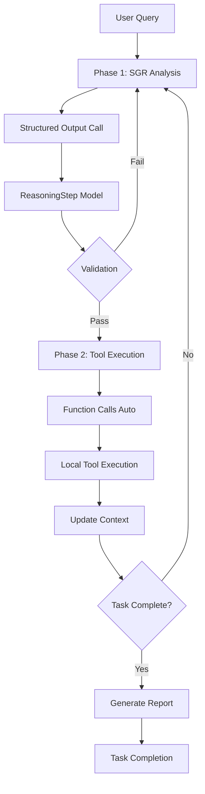

# SGR Research Agent - Two-Phase Architecture

A sophisticated research agent that combines **Schema-Guided Reasoning (SGR)** with **OpenAI Function Calls** to create a natural, interpretable, and powerful research workflow.

## 🧠 Core Innovation: Two-Phase Approach

Traditional agents either use pure function calls (losing reasoning transparency) or structured output with local execution (missing natural LLM behavior). This agent combines the best of both worlds:

### Phase 1: Reasoning (SGR)
- **Reasoning as a Tool** - `generate_reasoning` function call
- Controlled via `tool_choice="generate_reasoning"` 
- **Structured Output** for explicit reasoning analysis
- Model explains **what** to do and **why**
- Pure analytical thinking without tool execution
- Full transparency into decision-making process

### Phase 2: Action (Function Calls)
- **Native OpenAI Function Calls** with `tool_choice="auto"`
- Model naturally chooses appropriate tools based on reasoning
- Preserves LLM's natural conversation flow
- No disruption to chat template or message structure

## 🏗️ Architecture Benefits

### ✅ Natural LLM Behavior
- **Both phases use native OpenAI function calling**
- Phase 1: `tool_choice="generate_reasoning"` - forced reasoning
- Phase 2: `tool_choice="auto"` - natural tool selection
- Maintains proper chat message flow throughout
- Model decides tool usage naturally within OpenAI's framework
- No artificial constraints on LLM behavior

### ✅ Complete Interpretability
- Every decision is explicitly reasoned
- Clear explanation of **why** each action is taken
- Transparent thought process at each step
- Easy debugging and understanding

### ✅ Adaptive Planning
- Real-time adaptation based on new information
- Context-aware decision making
- Anti-cycling mechanisms to prevent loops
- Dynamic re-planning when needed

### ✅ Clean Architecture
- Modular design with clear separation of concerns
- Easy to extend and modify
- Type-safe with Pydantic models
- Comprehensive configuration system

## 📁 Project Structure

```
├── sgr_agent.py          # 🎯 Main orchestration engine
├── models.py             # 📊 Pydantic models for type safety
├── tool_schemas.py       # 🛠️ OpenAI function schemas  
├── executors.py          # ⚡ Tool execution logic
├── prompts.yaml          # 💬 System prompts configuration
├── config.yaml.example   # ⚙️ Configuration template
└── requirements.txt      # 📦 Python dependencies
```

## 🔄 Workflow Deep Dive



### Phase 1: Schema-Guided Reasoning as a Tool
```python
# Reasoning is implemented as a proper OpenAI function call
completion = client.chat.completions.create(
    tools=ALL_TOOLS,
    tool_choice={"type": "function", "function": {"name": "generate_reasoning"}},
    messages=conversation_history
)

# Inside generate_reasoning tool - Structured Output call
class ReasoningStep(BaseModel):
    reasoning_steps: List[str]           # Step-by-step analysis
    current_situation: str               # Current state assessment  
    next_action: Literal["search", "clarify", "report", "complete"]
    action_reasoning: str                # Why this action is needed
    task_completed: bool                 # Completion status
    # ... additional fields for progress tracking
```

**Key Innovation**: Reasoning is a **tool call**, not a separate API call:
- Model naturally calls `generate_reasoning` function
- Function internally uses Structured Output for analysis
- Returns structured reasoning to conversation history
- Maintains proper OpenAI message flow: assistant → tool → user
- No breaks in chat template or conversation structure

### Phase 2: Natural Function Calling
After reasoning, the model naturally calls appropriate tools:
```python
# Model decides which tools to call based on reasoning
completion = client.chat.completions.create(
    tools=ALL_TOOLS,
    tool_choice="auto",  # Let model decide naturally
    messages=conversation_history
)
```

Available tools:
- `generate_reasoning`: Analyze situation and plan next action (Phase 1)
- `web_search`: Research information with Tavily
- `clarification`: Ask user for clarification
- `create_report`: Generate comprehensive research report
- `report_completion`: Mark task as finished

**Note**: `generate_reasoning` is controlled via `tool_choice`, while other tools are selected naturally by the model via `tool_choice="auto"`.

## 🚀 Quick Start

### 1. Install Dependencies
```bash
pip install -r requirements.txt
```

### 2. Configure API Keys
```bash
export OPENAI_API_KEY="your-openai-key"
export TAVILY_API_KEY="your-tavily-key"
```

Or create `config.yaml`:
```yaml
openai:
  api_key: "your-openai-key"
  model: "gpt-4o-mini"
  temperature: 0.3

tavily:
  api_key: "your-tavily-key"

execution:
  max_rounds: 8
  max_searches_total: 6
```

### 3. Run the Agent
```bash
python sgr_agent.py
```

### 4. Example Usage
```
🔍 Enter research task: Analyze BMW M6 reliability and pricing trends

🧠 Reasoning Analysis
┌─────────────────┬────────────────────────────────────────┐
│ Current         │ User wants BMW M6 analysis             │
│ Next action     │ search                                 │  
│ Action reasoning│ Need pricing and reliability data      │
└─────────────────┴────────────────────────────────────────┘

🔎 Search: 'BMW M6 reliability reviews 2024'
   1. [1] BMW M6 Long-term Review — motortrend.com
   2. [2] M6 Reliability Issues — bmwblog.com
   ...
```

## 🎯 Why This Architecture Works

### 1. **Preserves LLM Nature**
Unlike pure structured output approaches, this preserves the LLM's natural conversational flow. The model can think, reason, and then act naturally.

### 2. **No Chat Template Disruption**
**Both phases use OpenAI's native function calling interface**:
- Phase 1: Reasoning via `tool_choice="generate_reasoning"` 
- Phase 2: Actions via `tool_choice="auto"`
- Conversation history remains clean and proper
- Natural assistant → tool → user message flow
- No artificial API calls or conversation breaks
- Maintains intended chat template structure throughout

### 3. **Complete Transparency**
Every decision is reasoned explicitly. You can see exactly why the model chose each action, making debugging and improvement straightforward.

### 4. **Adaptive Behavior**
The model can change its plan based on new information, handle unexpected results, and adapt its strategy dynamically.

### 5. **Type Safety**
Pydantic models ensure data integrity throughout the pipeline, catching errors early and providing clear interfaces.

## 🔧 Configuration

### Environment Variables
- `OPENAI_API_KEY`: Your OpenAI API key
- `TAVILY_API_KEY`: Your Tavily search API key  
- `OPENAI_MODEL`: Model to use (default: gpt-4o-mini)
- `MAX_ROUNDS`: Maximum research rounds (default: 8)
- `MAX_SEARCHES_TOTAL`: Maximum searches per session (default: 6)

### Advanced Configuration
Edit `prompts.yaml` to customize system prompts:
```yaml
structured_output_reasoning:
  template: |
    You are a reasoning module...
    # Customize reasoning instructions

outer_system:
  template: |
    You are an expert researcher...
    # Customize main system prompt
```

## 🧪 Example Research Session

```
User: "Research Tesla Model S vs BMW i7 electric luxury sedans"

Round 1 - Reasoning + Action
├── 🧠 Analysis: Need pricing and specs comparison
├── 🔍 Search: "Tesla Model S 2024 price specifications"
└── 📊 Results: 10 sources found

Round 2 - Reasoning + Action  
├── 🧠 Analysis: Have Tesla data, need BMW i7 info
├── 🔍 Search: "BMW i7 2024 electric sedan review price"
└── 📊 Results: 8 sources found

Round 3 - Reasoning + Action
├── 🧠 Analysis: Sufficient data for comparison report
├── 📄 Report: "Tesla Model S vs BMW i7 Comparison"
└── ✅ Completion: Task finished successfully

📊 Session Stats: 2 searches | 18 sources | 1 report generated
```

## 🤝 Contributing

1. Fork the repository
2. Create a feature branch
3. Make your changes with type hints and tests
4. Update documentation as needed
5. Submit a pull request

## 📝 License

MIT License - see LICENSE file for details.

## 🔗 Related Work

- [OpenAI Function Calling](https://platform.openai.com/docs/guides/function-calling)
- [Pydantic Models](https://docs.pydantic.dev/)
- [Tavily Search API](https://tavily.com/)

---

*Built with ❤️ for transparent, powerful AI research automation*
