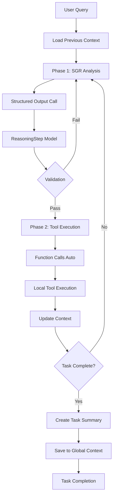

# SGR Research Agent - Neural Deep Agent

## Web interface

https://github.com/user-attachments/assets/85335b84-1d15-482b-a699-42c88604d3f5


## Terminal use
https://github.com/user-attachments/assets/ceea9fc7-2d1c-486c-b9df-6b8b43f7d84b


A sophisticated AI research agent that combines **Schema-Guided Reasoning (SGR)** with **OpenAI Function Calls** to create a natural, interpretable, and powerful research workflow with **persistent context memory**.

## 🧠 Core Innovation: Two-Phase Architecture + Context Memory

Traditional agents either use pure function calls (losing reasoning transparency) or structured output with local execution (missing natural LLM behavior). This agent combines the best of both worlds with **persistent memory across sessions**.

### Phase 1: Reasoning (SGR)
- **Reasoning as a Tool** - `generate_reasoning` function call
- Controlled via `tool_choice="generate_reasoning"` 
- **Structured Output** for explicit reasoning analysis
- Model explains **what** to do and **why**
- Pure analytical thinking without tool execution
- Full transparency into decision-making process

### Phase 2: Action (Function Calls)
- **Native OpenAI Function Calls** with `tool_choice="auto"`
- Model naturally chooses appropriate tools based on reasoning
- Preserves LLM's natural conversation flow
- No disruption to chat template or message structure

### 🔄 Context Memory System
- **Task Summaries** - automatically created after each completed task
- **Session History** - remembers previous requests and actions across tasks
- **File Memory** - tracks created and modified files
- **Anti-Forgetting** - context is preserved between different user queries

## ✨ Key Features

### 🔍 **Research & Information**
- **Web Search** - Internet research via Tavily API
- **Report Generation** - Comprehensive reports with citations
- **Date/Time Awareness** - Gets current date for time-sensitive queries
- **Adaptive Planning** - Real-time strategy adjustment

### 📁 **File Operations**
- **Read Files** - Analyze local file content
- **Create Files** - Generate new files with specified content
- **Update Files** - Modify existing files (append, prepend, replace)
- **File Memory** - Remembers all created files across sessions

### 📂 **Directory Operations**
- **List Directories** - Browse file structure with tree view
- **Create Directories** - Build new folder structures
- **Recursive Exploration** - Deep directory analysis

### 🧭 **Intelligent Communication**
- **Clarification** - Asks questions when requests are unclear
- **Simple Answers** - Quick responses without formal reports
- **Multi-language Support** - Russian and English
- **Context Awareness** - References previous conversations

### 🔄 **Session Memory**
- **Task History** - "What did I ask before?"
- **Action Memory** - "What files did we create?"
- **Continuous Context** - No information loss between tasks
- **Smart Summaries** - Efficient context compression

## 🏗️ Architecture Benefits

### ✅ Natural LLM Behavior
- **Both phases use native OpenAI function calling**
- Phase 1: `tool_choice="generate_reasoning"` - forced reasoning
- Phase 2: `tool_choice="auto"` - natural tool selection
- Maintains proper chat message flow throughout
- Model decides tool usage naturally within OpenAI's framework

### ✅ Complete Interpretability
- Every decision is explicitly reasoned
- Clear explanation of **why** each action is taken
- Transparent thought process at each step
- Easy debugging and understanding

### ✅ Persistent Memory
- **Cross-session continuity** - remembers previous interactions
- **Task summaries** - compact history storage
- **File tracking** - knows what was created/modified
- **Context integration** - seamlessly uses previous information

### ✅ Adaptive Planning
- Real-time adaptation based on new information
- Context-aware decision making
- Anti-cycling mechanisms to prevent loops
- Dynamic re-planning when needed

## 📁 Project Structure

```
├── sgr_agent.py          # 🎯 Main orchestration engine
├── models.py             # 📊 Pydantic models for type safety
├── tool_schemas.py       # 🛠️ OpenAI function schemas  
├── executors.py          # ⚡ Tool execution logic
├── prompts.yaml          # 💬 System prompts configuration
├── config.yaml.example   # ⚙️ Configuration template
└── requirements.txt      # 📦 Python dependencies
```

## 🔄 Workflow Deep Dive



## 🛠️ Available Tools

### Reasoning & Communication
- `generate_reasoning` - Analyze situation and plan next steps
- `clarification` - Ask clarifying questions when request is unclear
- `simple_answer` - Provide quick, direct answers

### Research & Information  
- `web_search` - Search the internet for information
- `create_report` - Generate comprehensive reports with citations
- `get_current_datetime` - Get current date and time

### File Operations
- `read_local_file` - Read content from local files
- `create_local_file` - Create new files with specified content
- `update_local_file` - Modify existing files (append, prepend, replace)

### Directory Operations
- `list_directory` - Show contents of directories (supports tree view)
- `create_directory` - Create new directories (with user confirmation)

### Task Management
- `report_completion` - Mark tasks as completed

## 🚀 Quick Start

### 1. Install Dependencies
```bash
pip install -r requirements.txt
```

### 2. Configure API Keys
```bash
export OPENAI_API_KEY="your-openai-key"
export TAVILY_API_KEY="your-tavily-key"
```

Or create `config.yaml`:
```yaml
openai:
  api_key: "your-openai-key"
  model: "gpt-4o"
  temperature: 0.3

tavily:
  api_key: "your-tavily-key"

execution:
  max_rounds: 8
  max_searches_total: 6
```

### 3. Run the Agent

#### Console Interface
```bash
python sgr_agent.py
```

#### Web Interface (Recommended)
```bash
chainlit run gui_app.py -w
```

The web interface will be available at [http://localhost:8000](http://localhost:8000)

**Web Interface Features:**
- 🌐 Beautiful chat interface
- 📊 Real-time progress tracking
- 📄 Formatted reports and results
- 🎨 Visual feedback for all operations
- 📱 Mobile-friendly design
- 🔄 Auto-reload during development (with `-w` flag)

## 🧪 Example Sessions

### Research Session
```
🔍 Enter research task: Find current Bitcoin price

🧠 Analysis: Need current date for accurate pricing
🕒 Getting current date: 2025-08-29
🔎 Search: 'Bitcoin price 29 August 2025'
💬 Answer: Bitcoin is trading at $166,912 (projected)
```

### File Operations Session
```
🔍 Enter research task: Create a Python script for data analysis

🧠 Analysis: User wants Python script creation
📝 Creating file: data_analysis.py
✅ File created with data processing functions
```

### Context Memory Session
```
🔍 Enter research task: What did I ask before?

🧠 Analysis: Checking previous session history
📋 Previous actions:
   - Request: 'Find Bitcoin price' → Actions: web search, simple answer
   - Request: 'Create Python script' → Actions: file creation
💬 Answer: You previously asked about Bitcoin price and Python script creation
```

## 🔧 Configuration

### Environment Variables
- `OPENAI_API_KEY`: Your OpenAI API key
- `TAVILY_API_KEY`: Your Tavily search API key  
- `OPENAI_MODEL`: Model to use (default: gpt-4o)
- `MAX_ROUNDS`: Maximum research rounds (default: 8)
- `MAX_SEARCHES_TOTAL`: Maximum searches per session (default: 6)

### Advanced Configuration
Edit `prompts.yaml` to customize system prompts:
```yaml
structured_output_reasoning:
  template: |
    You are a reasoning module...
    # Customize reasoning instructions

outer_system:
  template: |
    You are an expert researcher...
    # Customize main system prompt
```

## 🌟 Advanced Features

### Context Memory System
The agent maintains memory across sessions through:

1. **Task Summaries** - Each completed task creates a structured summary
2. **History Integration** - Previous actions are loaded into new conversations
3. **File Tracking** - All created/modified files are remembered
4. **Smart Context** - Relevant history is automatically included

### Anti-Cycling Protection
- Prevents repetitive clarification requests
- Detects and breaks reasoning loops
- Ensures forward progress on tasks

### Multilingual Support
- Automatic language detection from user input
- Consistent language usage throughout responses
- Russian and English support

### Error Recovery
- Graceful handling of API failures
- Structured output validation with fallbacks
- Context preservation during errors

## 🧪 Example Research Session

```
Session 1:
User: "Research Tesla Model S pricing"
Agent: Creates comprehensive report → Saves to context

Session 2:  
User: "What did I research before?"
Agent: "You researched Tesla Model S pricing and created a report"

Session 3:
User: "Now compare with BMW i7"
Agent: References previous Tesla research → Creates comparison
```

## 🌐 Web Interface

The project includes a modern web interface built with **Chainlit** that provides a superior user experience compared to the console version.

### Features
- **Interactive Chat** - Natural conversation flow with the AI agent
- **Beautiful UI** - Modern, responsive design that works on all devices  
- **Real-time Updates** - Watch the agent's reasoning and tool execution live
- **Rich Content** - Formatted reports, code blocks, and structured data display
- **Progress Tracking** - Visual indicators for search progress and tool execution
- **Session Management** - Automatic context preservation between conversations
- **Error Handling** - Graceful error display and recovery options

### Running the Web Interface
```bash
# Install chainlit if not already installed
pip install chainlit>=1.0.0

# Start the web interface with auto-reload
chainlit run gui_app.py -w

# Interface will be available at http://localhost:8000
```

### Web Interface vs Console
| Feature | Console | Web Interface |
|---------|---------|---------------|
| User Experience | Text-based | Rich, interactive |
| Visual Feedback | Limited | Comprehensive |
| Progress Tracking | Basic | Real-time with animations |
| Report Display | Plain text | Formatted with syntax highlighting |
| Mobile Support | No | Yes |
| Multi-session | Manual | Automatic |
| File Operations | Text output | Visual file browser |

### Configuration
The web interface automatically uses the same configuration as the console version:
- API keys from `config.yaml` or environment variables
- Same tool set and capabilities
- Identical reasoning and memory systems

## 🤝 Contributing

1. Fork the repository
2. Create a feature branch
3. Make your changes with type hints and tests
4. Update documentation as needed
5. Submit a pull request

## 📝 License

MIT License - see LICENSE file for details.

## 🔗 Related Work

- [OpenAI Function Calling](https://platform.openai.com/docs/guides/function-calling)
- [Pydantic Models](https://docs.pydantic.dev/)
- [Tavily Search API](https://tavily.com/)

---

*Built with ❤️ for transparent, powerful AI research automation with persistent memory*
