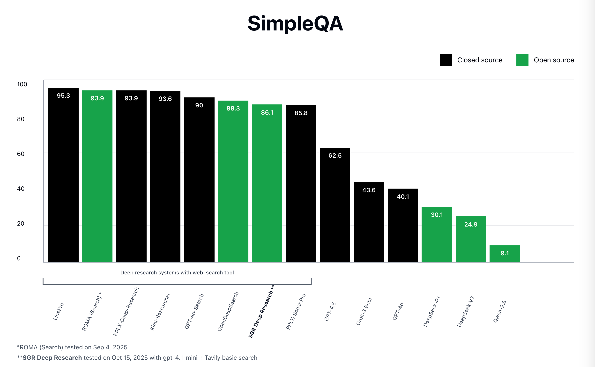

# 📊 SGR Deep Research - SimpleQA Benchmark



Comprehensive benchmark evaluation using the SimpleQA dataset - a factuality benchmark that measures the ability of language models to answer short, fact-seeking questions.

______________________________________________________________________

## 📁 About SimpleQA Dataset

**Link:** https://huggingface.co/datasets/basicv8vc/SimpleQA

SimpleQA Verified is a benchmark for evaluating factual accuracy of AI systems. The dataset contains questions with verified correct answers.

**Dataset Size:** 4,236 questions

**Evaluation Categories:**

- ✅ **CORRECT** - Answer fully contains correct information
- ❌ **INCORRECT** - Answer contains contradictions or false information
- ⏭️ **NOT_ATTEMPTED** - System did not attempt to answer the question

______________________________________________________________________

## 🎯 Our Results

- **Accuracy:** 86.08%
- **Correct:** 3,724 answers
- **Incorrect:** 554 answers
- **Not Attempted:** 48 answers

**Detailed Results:** [simpleqa_result.xlsx](../assets/simpleqa_result.xlsx)

______________________________________________________________________

## ⚙️ Agent Configuration for Benchmark Run

| Component         | Parameter        | Value                  |
| ----------------- | ---------------- | ---------------------- |
| **Search Engine** | Provider         | Tavily Basic Search    |
|                   | Scraping Enabled | Yes                    |
|                   | Max Pages        | 5                      |
|                   | Content Limit    | 33,000 characters      |
| **Agent**         | Name             | sgr_tool_calling_agent |
|                   | Max Steps        | 20                     |
| **LLM (Agent)**   | Model            | gpt-4.1-mini           |
|                   | Max Tokens       | 12,000                 |
|                   | Temperature      | 0.2                    |
| **LLM (Judge)**   | Model            | gpt-4o                 |
|                   | Max Tokens       | Default                |
|                   | Temperature      | Default                |

______________________________________________________________________

## 🚀 How to Run the Benchmark

### Requirements

Before running the benchmark, ensure you have:

1. **SimpleQA Dataset**: Download from [Hugging Face](https://huggingface.co/datasets/basicv8vc/SimpleQA)
2. **Judge Model Access**: LLM for grading answers (e.g., GPT-4, Claude, or local model)
3. **Dependencies**: Install required packages
   ```bash
   cd benchmark
   uv pip install -r requirements.txt  # or pip install openai pandas python-dotenv openpyxl
   ```

### Environment Variables Setup

The benchmark uses a separate `.env` file for judge model configuration:

1. **Create `.env` file in benchmark directory:**

   ```bash
   cd benchmark
   cp env.example .env
   ```

2. **Configure judge model parameters in `.env`:**

   ```bash
   # Judge Model Configuration
   JUDGE_BASE_URL=https://api.openai.com/v1
   JUDGE_API_KEY=your-api-key-here
   JUDGE_MODEL_NAME=gpt-4o-mini
   ```

**Recommended Judge Models:**

- `gpt-4o-mini` - Best cost/quality ratio
- `gpt-4o` - Maximum accuracy
- `claude-3-sonnet` - Alternative provider
- Local model (e.g., `http://localhost:8090/v1`)

### Running the Benchmark

Navigate to the benchmark directory and run:

```bash
cd benchmark

# Basic usage with default settings
python run_benchmark.py \
    --path_to_simpleqa ./data/simpleqa_verified.csv \
    --output_path ./simpleqa_bench_results.xlsx \
    --n_samples 100 \
    --batch_size 3

# Process entire dataset with larger batches
python run_benchmark.py \
    --path_to_simpleqa ./data/simpleqa_verified.csv \
    --output_path ./simpleqa_bench_results.xlsx \
    --batch_size 10
```

### Command Line Arguments

| Parameter            | Required | Default                     | Description                                |
| -------------------- | -------- | --------------------------- | ------------------------------------------ |
| `--path_to_simpleqa` | Yes      | -                           | Path to simpleqa_verified.csv file         |
| `--output_path`      | No       | simpleqa_bench_results.xlsx | Path to output Excel file                  |
| `--n_samples`        | No       | All samples                 | Number of samples to process from dataset  |
| `--batch_size`       | No       | 10                          | Number of questions to process in parallel |

**Note:** Judge model settings are loaded from `.env` file (JUDGE_BASE_URL, JUDGE_API_KEY, JUDGE_MODEL_NAME)

______________________________________________________________________

## 📊 Output Files

The benchmark generates an Excel file with detailed results:

**Results Excel** (`simpleqa_bench_results.xlsx`):

- Question and ground truth answer
- Predicted answer from SGR agent
- Grade classification (CORRECT/INCORRECT/NOT_ATTEMPTED)
- Detailed grading report with reasoning
- Error tracking for failed attempts

______________________________________________________________________

## ✨ Benchmark Features

### 🔄 Auto-Resume Support

The benchmark automatically resumes from the last completed question if interrupted. Simply rerun the same command.

### 📊 Batch Processing

Process questions in parallel batches for faster execution (configurable via `--batch_size`)

**Example log output:**

```bash
2024-01-13 12:00:00 - __main__ - INFO - Using config file: C:\path\to\config.yaml
2024-01-13 12:00:05 - __main__ - INFO - Started batch 1/34 (questions 1-3)
2024-01-13 12:00:45 - __main__ - INFO - Completed batch 1/34. Processed questions: 3/100
2024-01-13 12:00:45 - __main__ - INFO - Started batch 2/34 (questions 4-6)
...
2024-01-13 12:45:30 - __main__ - INFO - Benchmark completed!
```

______________________________________________________________________

## 🛠️ How It Works

The benchmark uses the **LLM-as-a-Judge** approach for answer evaluation, where an LLM acts as an impartial judge to assess the correctness of agent responses.

1. **Configuration Loading**: Loads `config.yaml` from project root for SGR agent settings
2. **Batch Processing**: Processes questions in parallel batches for efficiency
3. **Research Phase**: Each question is researched by BenchmarkAgent using web search
4. **Answer Extraction**: Extracts the final answer from agent's execution result
5. **Judge Grading**: LLM judge evaluates answer against ground truth using structured prompts
6. **Results Export**: Results are saved to Excel after each batch (auto-resume support)

______________________________________________________________________

## 📁 Benchmark Files

- `run_benchmark.py` - Main benchmark script
- `benchmark_agent.py` - BenchmarkAgent class
- `prompts.py` - Grading prompt templates
- `utils.py` - Utility functions
- `env.example` - Environment variables example
- `README.md` - This file
