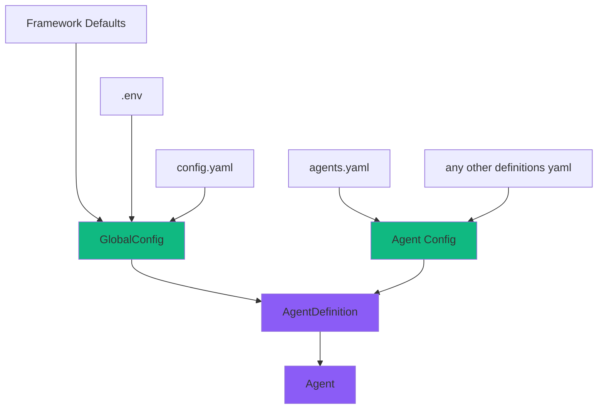

# Configuration Guide

Это руководство описывает систему конфигурации SGR Agent Core и способы настройки агентов для вашего проекта.

## Иерархия

Система конфигурации построена по принципу дополнения:
Общие настройки из основного конфига переопределяют defaults,
а специфичные из `agents` переопределяют необходимые параметры для каждого конкретного агента на уровне `AgentDefinition`.



## GlobalConfig

!!! Important "Важно: Единый инстанс GlobalConfig"
    Все вызовы `GlobalConfig()` возвращают один и тот же экземпляр. Это означает, что при создании нескольких объектов `GlobalConfig` вы получите ссылку на один и тот же объект в памяти.

    Единожды применённые изменения и загруженные конфигурации распространятся на всю программу.

### Загрузка из переменных окружения (.env)

`GlobalConfig` использует `pydantic-settings` для автоматической загрузки настроек из переменных окружения. Все переменные должны иметь префикс `SGR__` и использовать двойное подчёркивание `__` для вложенных параметров.

```python
from sgr_agent_core import GlobalConfig

config = GlobalConfig()
```
Пример можно найти в [`.env.example`](https://github.com/vamplabAI/sgr-agent-core/blob/main/.env.example).

### Загрузка из YAML файла

Для более структурированной конфигурации можно использовать YAML файлы:

```python
from sgr_agent_core import GlobalConfig

# Загрузка из config.yaml
config = GlobalConfig.from_yaml("config.yaml")
```


Пример можно найти в [`config.yaml.example`](https://github.com/vamplabAI/sgr-agent-core/blob/main/config.yaml.example).


### Переопределение параметров

**Ключевая особенность:** `AgentDefinition` наследует все параметры из `GlobalConfig` и переопределяет только те, которые указаны явно. Это позволяет создавать минималистичные конфигурации, указывая только необходимые изменения.

### Примеры конфигурации агентов

Агенты определяются в файле `agents.yaml` или могут быть загружены программно:

```python
from sgr_agent_core import GlobalConfig

config = GlobalConfig.from_yaml("config.yaml")
config.definitions_from_yaml("agents.yaml")
config.definitions_from_yaml("more_agents.yaml")
```
!!!warning
    Метод `definitions_from_yaml` объединяет новые определения с существующими, перезаписывая агентов с одинаковыми именами

#### Пример 1: Минимальная конфигурация

Агент, который переопределяет только модель LLM и набор инструментов:

```yaml
agents:
  simple_agent:
    base_class: "SGRToolCallingAgent"

    # Переопределяем только модель
    llm:
      model: "gpt-4o-mini"

    # Указываем минимальный набор инструментов
    tools:
      - "WebSearchTool"
      - "FinalAnswerTool"
```

В этом примере агент `simple_agent` использует:
- Все настройки LLM из `GlobalConfig`, кроме `model`
- Все настройки поиска из `GlobalConfig`
- Все настройки выполнения из `GlobalConfig`
- Только два указанных инструмента

#### Пример 2: Полная кастомизация

Агент с полным переопределением параметров:

```yaml
agents:
  custom_research_agent:
    base_class: "sgr_agent_core.agents.sgr_agent.ResearchSGRAgent"

    # Переопределяем LLM настройки
    llm:
      model: "gpt-4o"
      temperature: 0.3
      max_tokens: 16000
      # api_key и base_url наследуются из GlobalConfig

    # Переопределяем настройки поиска
    search:
      max_results: 15
      max_searches: 6
      content_limit: 2000

    # Переопределяем настройки выполнения
    execution:
      max_iterations: 15
      max_clarifications: 5
      max_searches: 6
      logs_dir: "logs/custom_agent"
      reports_dir: "reports/custom_agent"

    # Полный набор инструментов
    tools:
      - "WebSearchTool"
      - "ExtractPageContentTool"
      - "CreateReportTool"
      - "ClarificationTool"
      - "GeneratePlanTool"
      - "AdaptPlanTool"
      - "FinalAnswerTool"
```

#### Пример 3: Оптимизированный для скорости

Агент с настройками для быстрого выполнения:

```yaml
agents:
  fast_research_agent:
    base_class: "SGRToolCallingAgent"

    llm:
      model: "gpt-4o-mini"
      temperature: 0.1  # Более детерминированные ответы
      max_tokens: 4000  # Меньше токенов для быстрого ответа

    execution:
      max_iterations: 8  # Меньше итераций
      max_clarifications: 2
      max_searches: 3

    tools:
      - "WebSearchTool"
      - "CreateReportTool"
      - "FinalAnswerTool"
      - "ReasoningTool"
```

#### Пример 4: С кастомными промптами

Агент с переопределением системных промптов:

```yaml
agents:
  technical_analyst:
    base_class: "SGRAgent"

    llm:
      model: "gpt-4o"
      temperature: 0.2

    # Переопределяем промпты
    prompts:
      system_prompt_str: |
        You are a highly specialized technical analyst.
        Your expertise includes deep technical analysis and
        detailed research documentation.

    execution:
      max_iterations: 20
      max_searches: 8

    tools:
      - "WebSearchTool"
      - "ExtractPageContentTool"
      - "CreateReportTool"
      - "ClarificationTool"
      - "FinalAnswerTool"
```


## Рекомендации

- **Храните секреты в .env** - не коммитьте чувствительные ключи в репозиторий =)

    В production окружении рекомендуется использовать ENV переменные вместо хардкода ключей в YAML

- **Используйте минимальные переопределения** - указывайте только то, что отличается от GlobalConfig
- **Храните Definitions, a не Agents** - Агенты создаются под непосредственное выполнение задачи,
их definitions можно добавлять/удалять/изменять в любое время
