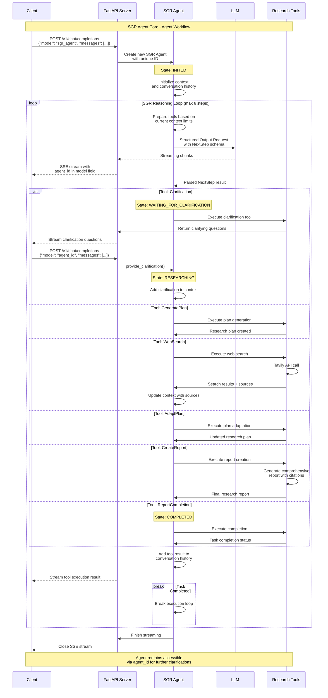

## 🧶 Agent Execution Sequence

The following diagram shows the complete SGR agent workflow with interruption and clarification support:

## 🤖 Schema-Guided Reasoning Capabilities:

1. **🤔 Clarification** - clarifying questions when unclear
2. **📋 Plan Generation** - research plan creation
3. **🔍 Web Search** - internet information search
4. **🔄 Plan Adaptation** - plan adaptation based on results
5. **📝 Report Creation** - detailed report creation
6. **✅ Final Answer** - task completion
