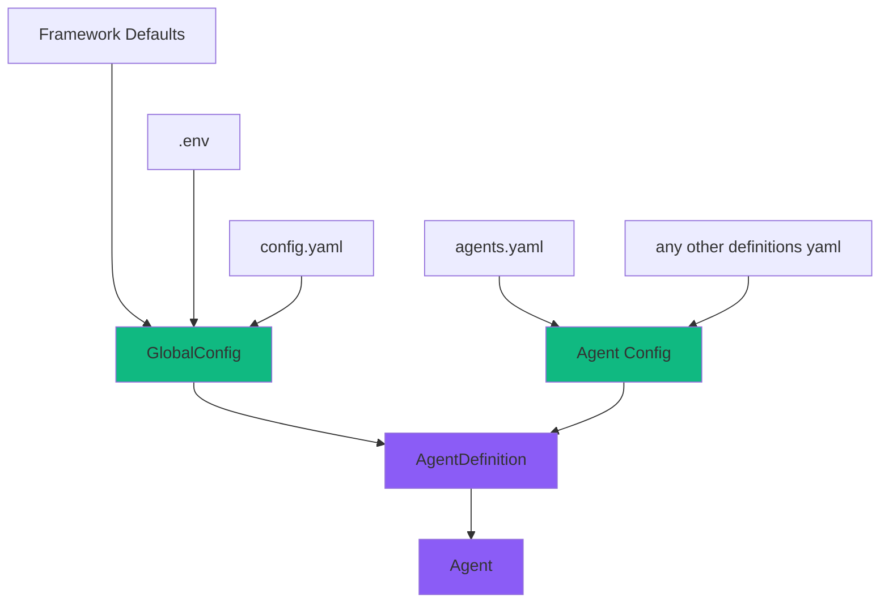

# Configuration Guide

This guide describes the SGR Agent Core configuration system and ways to configure agents for your project.

## Hierarchy

The configuration system is built on the principle of extension:
Common settings from the main config override defaults,
and specific settings from `agents` override necessary parameters for each specific agent at the `AgentDefinition` level.



## GlobalConfig

!!! Important "Important: Single GlobalConfig Instance"
    All calls to `GlobalConfig()` return the same instance. This means that when creating multiple `GlobalConfig` objects, you will get a reference to the same object in memory.

    Once applied changes and loaded configurations will propagate throughout the program.

### Loading from Environment Variables (.env)

`GlobalConfig` uses `pydantic-settings` to automatically load settings from environment variables. All variables must have the `SGR__` prefix and use double underscores `__` for nested parameters.

```python
from sgr_agent_core import GlobalConfig

config = GlobalConfig()
```

An example can be found in [`.env.example`](https://github.com/vamplabAI/sgr-agent-core/blob/main/.env.example).

### Loading from YAML File

For more structured configuration, you can use YAML files:

```python
from sgr_agent_core import GlobalConfig

# Load from config.yaml
config = GlobalConfig.from_yaml("config.yaml")
```

An example can be found in [`config.yaml.example`](https://github.com/vamplabAI/sgr-agent-core/blob/main/config.yaml.example).

### Parameter Override

**Key Feature:** `AgentDefinition` inherits all parameters from `GlobalConfig` and overrides only those explicitly specified. This allows creating minimal configurations by specifying only necessary changes.

### Agent Configuration Examples

Agents are defined in the `agents.yaml` file or can be loaded programmatically:

```python
from sgr_agent_core import GlobalConfig

config = GlobalConfig.from_yaml("config.yaml")
config.definitions_from_yaml("agents.yaml")
config.definitions_from_yaml("more_agents.yaml")
```

!!!warning
    The `definitions_from_yaml` method merges new definitions with existing ones, overwriting agents with the same names

#### Example 1: Minimal Configuration

An agent that overrides only the LLM model and toolset:

```yaml
agents:
  simple_agent:
    base_class: "SGRToolCallingAgent"

    # Override only the model
    llm:
      model: "gpt-4o-mini"

    # Specify minimal toolset
    tools:
      - "WebSearchTool"
      - "FinalAnswerTool"
```

In this example, the `simple_agent` uses:

- All LLM settings from `GlobalConfig`, except `model`
- All search settings from `GlobalConfig`
- All execution settings from `GlobalConfig`
- Only the two specified tools

#### Example 2: Full Customization

An agent with full parameter override:

```yaml
agents:
  custom_research_agent:
    base_class: "sgr_agent_core.agents.sgr_agent.ResearchSGRAgent"

    # Override LLM settings
    llm:
      model: "gpt-4o"
      temperature: 0.3
      max_tokens: 16000
      # api_key and base_url are inherited from GlobalConfig

    # Override search settings
    search:
      max_results: 15
      max_searches: 6
      content_limit: 2000

    # Override execution settings
    execution:
      max_iterations: 15
      max_clarifications: 5
      max_searches: 6
      logs_dir: "logs/custom_agent"
      reports_dir: "reports/custom_agent"

    # Full toolset
    tools:
      - "WebSearchTool"
      - "ExtractPageContentTool"
      - "CreateReportTool"
      - "ClarificationTool"
      - "GeneratePlanTool"
      - "AdaptPlanTool"
      - "FinalAnswerTool"
```

#### Example 3: Speed-Optimized

An agent with settings for fast execution:

```yaml
agents:
  fast_research_agent:
    base_class: "SGRToolCallingAgent"

    llm:
      model: "gpt-4o-mini"
      temperature: 0.1  # More deterministic responses
      max_tokens: 4000  # Fewer tokens for faster response

    execution:
      max_iterations: 8  # Fewer iterations
      max_clarifications: 2
      max_searches: 3

    tools:
      - "WebSearchTool"
      - "CreateReportTool"
      - "FinalAnswerTool"
      - "ReasoningTool"
```

#### Example 4: With Custom Prompts

An agent with system prompt override:

```yaml
agents:
  technical_analyst:
    base_class: "SGRAgent"

    llm:
      model: "gpt-4o"
      temperature: 0.2

    # Override prompts
    prompts:
      system_prompt_str: |
        You are a highly specialized technical analyst.
        Your expertise includes deep technical analysis and
        detailed research documentation.

    execution:
      max_iterations: 20
      max_searches: 8

    tools:
      - "WebSearchTool"
      - "ExtractPageContentTool"
      - "CreateReportTool"
      - "ClarificationTool"
      - "FinalAnswerTool"
```

## Recommendations

- **Store secrets in .env** - don't commit sensitive keys to the repository =)

  In production environments, it's recommended to use ENV variables instead of hardcoding keys in YAML

- **Use minimal overrides** - specify only what differs from GlobalConfig

- **Store Definitions, not Agents** - Agents are created for direct task execution,
  their definitions can be added/removed/modified at any time
