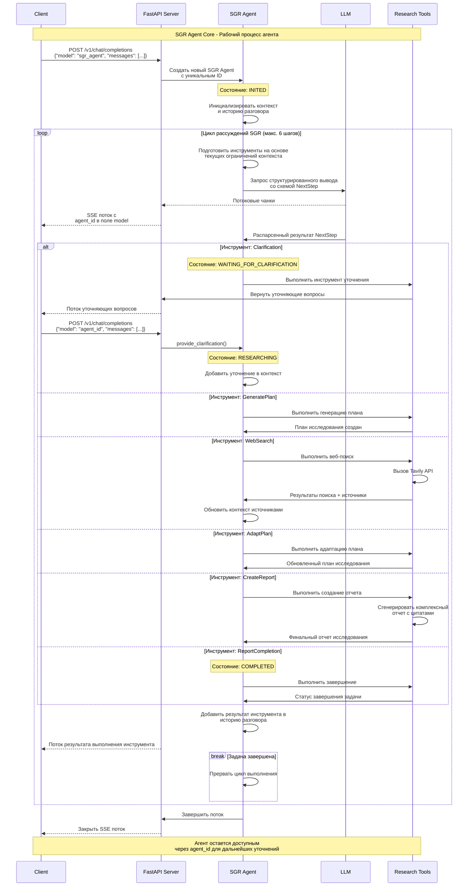

## 🧶 Последовательность выполнения агента

На следующей диаграмме показан полный рабочий процесс SGR агента с поддержкой прерывания и уточнений:

## 🤖 Возможности Schema-Guided Reasoning:

1. **🤔 Clarification** - уточняющие вопросы при неясности
2. **📋 Plan Generation** - создание плана исследования
3. **🔍 Web Search** - поиск информации в интернете
4. **🔄 Plan Adaptation** - адаптация плана на основе результатов
5. **📝 Report Creation** - создание детального отчета
6. **✅ Final Answer** - завершение задачи
